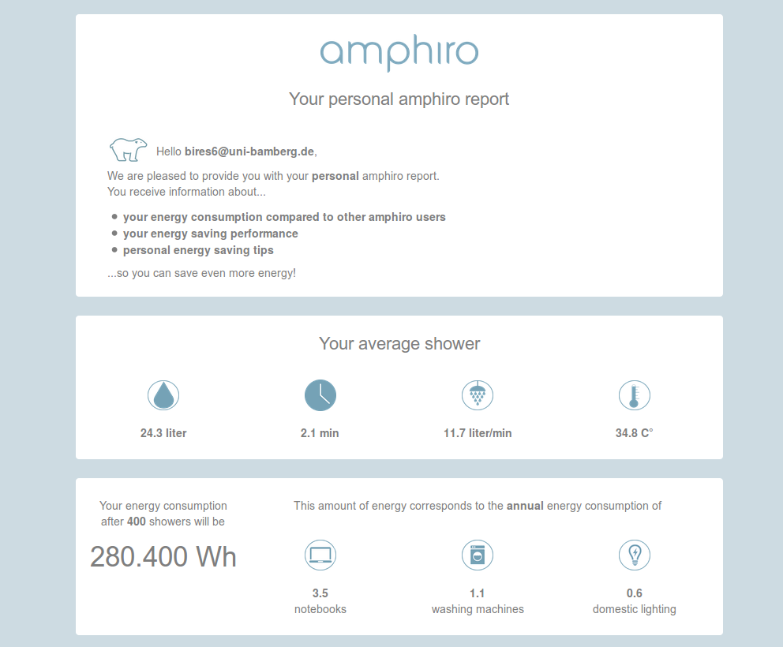

# Energy-Analyzer-and-Mailer
This software is a extension for the [Amphiro](https://www.amphiro.com/). It sends an Email report about the energy consumption during showers to each Amphiro user. Thereby, the data is displayed in a way that the user is motivated to conserve energy.

## How does it work?

The input data (= shower consumption data) is analyzed by means of statistical calculations. These results are used to generate a report about the users' showering consumption. In the report, psychological tricks are applied in order to achieve maximum conservation effects (e.g. theory of planned behavior, peer group comparison, goal setting, gamification etc.).
After the report has been generated, users receive this report as an email into their mailbox. This is an example output of the software for a specific user:

## Can I use this software?

The software is the outcome of a student project at the [Chair of Energy Efficient Systems, University of Bamberg](https://www.uni-bamberg.de/en/eesys/). During this project, we had access to consumption data, which is privacy
protected. Thus, the data is not publicly available and the software does not make sense to be executed without this related data.  
If you are interested, get in touch by [one of the channels here](http://mathias-renner.de).

## License: MIT

Copyright (c) 2016 Clemens Jakob, Max Raab, Mathias Renner

Permission is hereby granted, free of charge, to any person obtaining a copy of this software and associated documentation files (the "Software"), to deal in the Software without restriction, including without limitation the rights to use, copy, modify, merge, publish, distribute, sublicense, and/or sell copies of the Software, and to permit persons to whom the Software is furnished to do so, subject to the following conditions:

The above copyright notice and this permission notice shall be included in all copies or substantial portions of the Software.

THE SOFTWARE IS PROVIDED "AS IS", WITHOUT WARRANTY OF ANY KIND, EXPRESS OR IMPLIED, INCLUDING BUT NOT LIMITED TO THE WARRANTIES OF MERCHANTABILITY, FITNESS FOR A PARTICULAR PURPOSE AND NONINFRINGEMENT. IN NO EVENT SHALL THE AUTHORS OR COPYRIGHT HOLDERS BE LIABLE FOR ANY CLAIM, DAMAGES OR OTHER LIABILITY, WHETHER IN AN ACTION OF CONTRACT, TORT OR OTHERWISE, ARISING FROM, OUT OF OR IN CONNECTION WITH THE SOFTWARE OR THE USE OR OTHER DEALINGS IN THE SOFTWARE.
